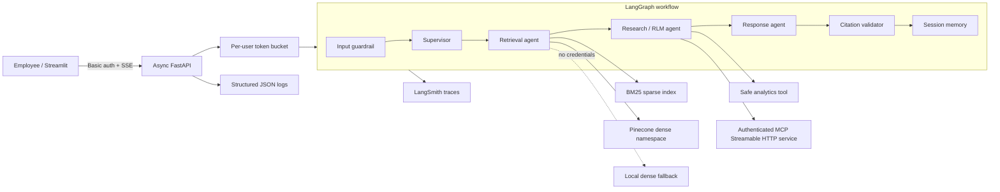

# Architecture

## Request flow

1. FastAPI authenticates the user and consumes a token from their rate-limit bucket.
2. The guardrail validates request length and rejects common instruction override, secret extraction, and RBAC-bypass patterns.
3. The supervisor loads bounded session context and classifies the request as search, research, or enterprise-tool intent.
4. Retrieval runs sparse and dense work asynchronously, applies metadata plus access-level filters, normalizes scores, and fuses ranks. Pinecone queries use the same configured OpenAI embedding model as ingestion.
5. Research emits a Python search plan, applies topic/date targeting, and splits evidence into small batches. Independently traced sub-agent findings are produced concurrently and aggregated with safe, predefined analytics. Depth and batch size are bounded.
6. The response agent receives only relevant evidence. Retrieved text is explicitly treated as untrusted data.
7. The validator removes citations that do not match retrieved document IDs. The completed turn is persisted in user-isolated SQLite conversation memory.
8. Node transitions, tool calls, retrieval results, memory changes, validation events, and model tokens stream to the UI as they occur.

## Failure containment

Each integration has a defined boundary. Retrieval timeouts fail the request without executing subsequent tools. MCP failure returns a labelled local fallback. An LLM failure is converted by the API into a generic 503 without leaking credentials or stack traces. RLM batches are independent, bounded, and aggregated only after completion, limiting cascading or "butterfly effect" failures.

## Production evolution

- Replace Basic auth with OIDC/Keycloak and derive departments from signed claims.
- Replace SQLite memory and process-local rate buckets with Redis/Postgres and encrypted retention policies.
- Provision separate Pinecone namespaces per tenant and use server-side metadata filters.
- Add a cross-encoder reranker, document-level ACL service, content DLP, malware scanning, and a policy engine such as OPA.
- Replace the POC MCP shared secret with workload identity or mTLS and rotate credentials automatically.
- Add a human approval node before mutating/admin tools. Current tools are read-only, so approval is not required.

## Model rationale

`gpt-4.1-mini` is the default because the POC favors low latency, tool use, and instruction following. Temperature is zero for repeatability. The model is isolated behind one module so a larger reasoning model can be selected for complex research while preserving the graph and controls. Local extractive generation ensures an evaluator is not blocked by missing credentials.
